# Dhwani Sarathi

### SiH 1403 : App Based Audiometer
### Problem Statement:

>To know a person Hearing Loss, generally we use a Pure Tone Audiometer. To use this it requires a bulk of the instrument to be carried. This testing requires a considerable amount of time for testing. It was observed that during a large level hearing testing it is consuming much time. So a hand held Mobile phone operated APP BASED AUDIOMETER will be of immense useful in finding and detecting the hearing loss in children in a schools

### Motivation:
Introducing an app-based audiometer for school screenings revolutionizes the way we detect and address hearing loss in children. This mobile phone-operated solution offers unparalleled accessibility, convenience, and cost-effectiveness, drastically reducing testing time while ensuring early detection. By leveraging modern technology, this app empowers healthcare providers, educators, and parents to swiftly identify potential hearing issues, enabling timely intervention and fostering better academic and social outcomes for children.

### Features of App
- Pure Tone Audiometry Test
- Results, Analysis and Interpretation of Test
- Classroom Based Managament system with Analytics
- Connect to Nearest Doctor
- Digitization of physical audiometry documents
- and many more..

### Tech Stack
- React Native
- Django

## Screenshots
<p>
<h3>Authentication</h3>
 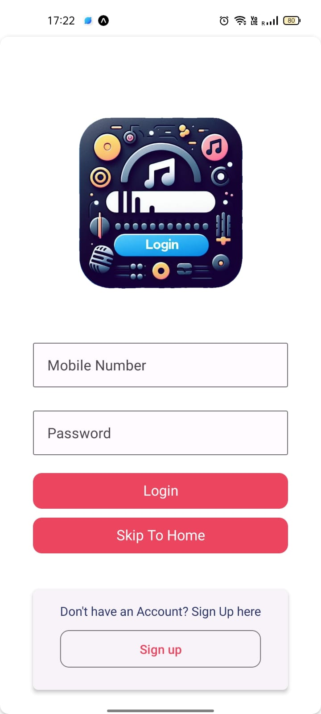&emsp;
 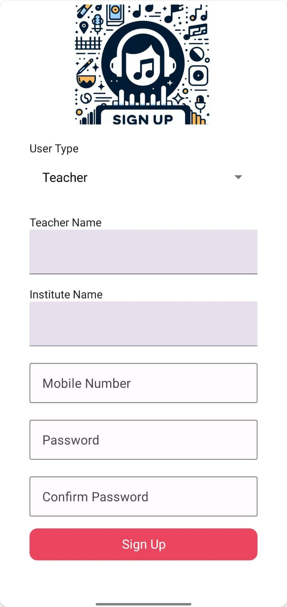&emsp;
  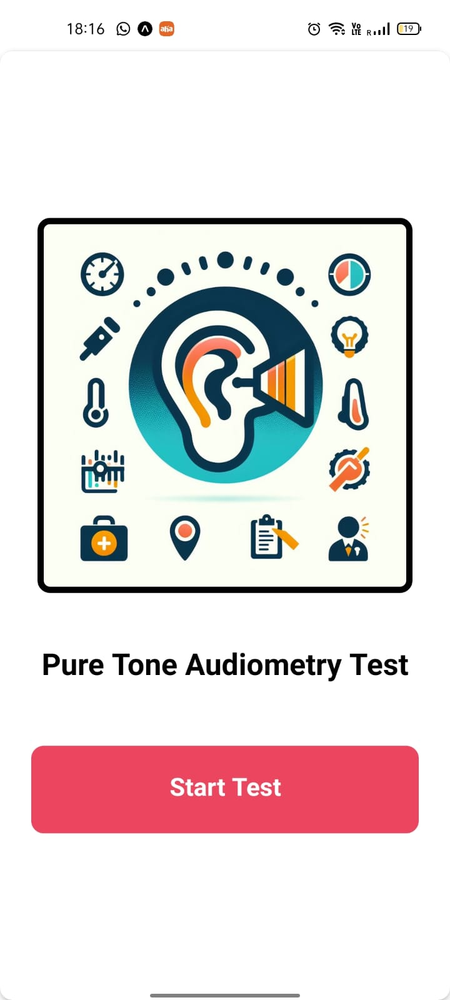&emsp;
</p>

<p>
<h3>User View</h3>
 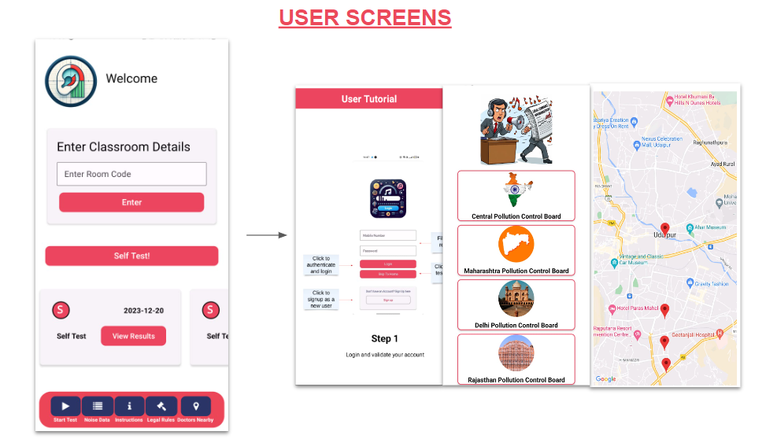&emsp;
</p>

<p>
<h3>Preliminary Checks</h3>
 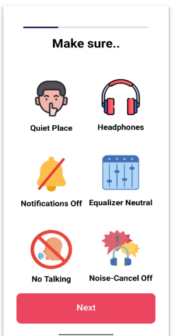&emsp;
 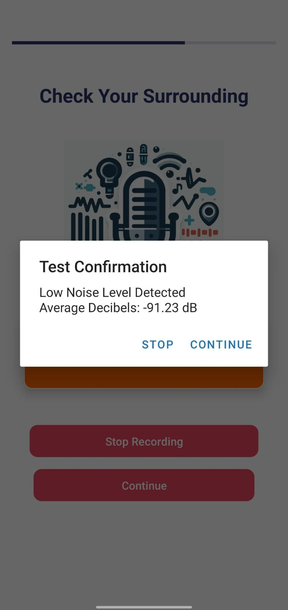&emsp;
 <br>
 &emsp;
 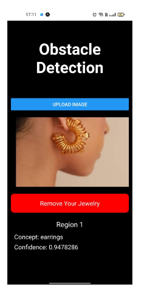&emsp;

</p>

<p>
<h3>Test</h3>
 &emsp;
</p>

<p>
<h3>Results</h3>
 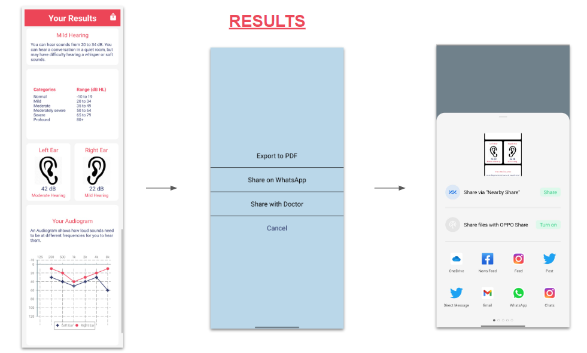&emsp;
 <br>
 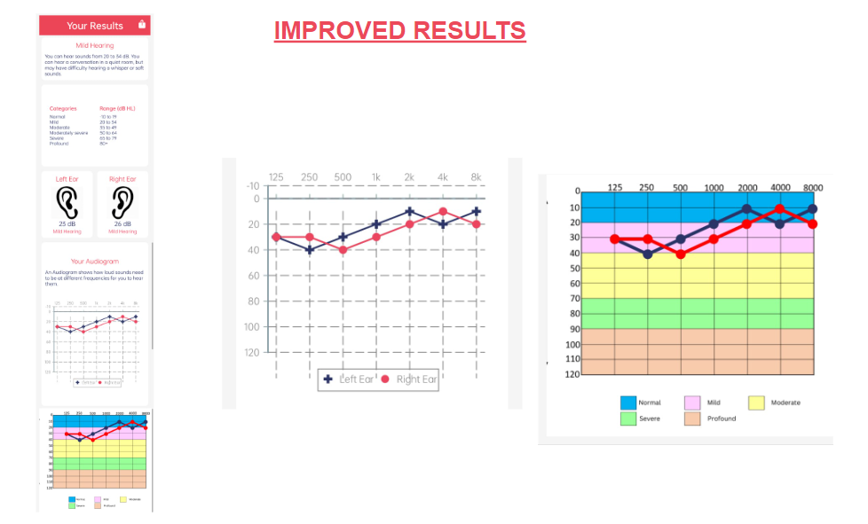&emsp;
</p>

<p>
<h3>Teacher View</h3>
 &emsp;
 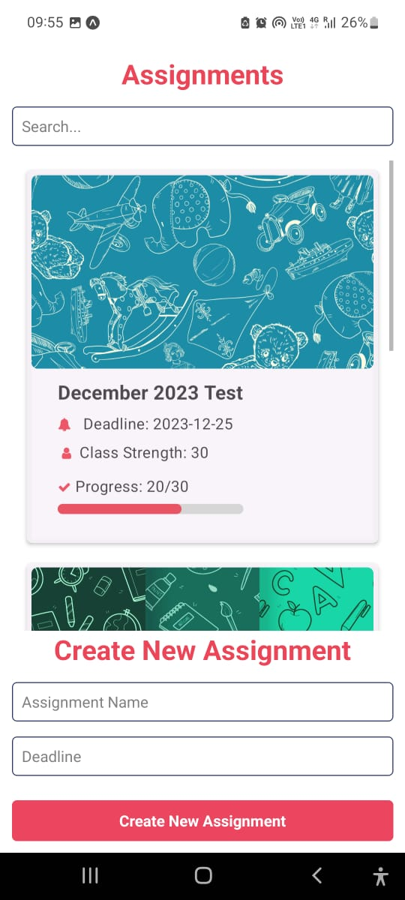&emsp;
</p>

<p>
<h3>Analytics</h3>
 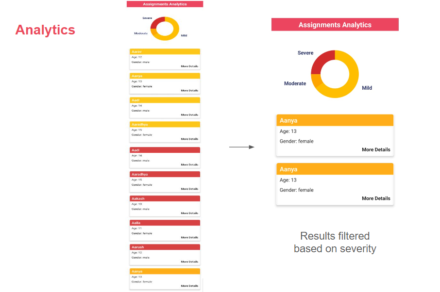&emsp;
</p>

## Getting Started
### Frontend
- Clone the repository
- Run the below commands:

```shell
cd audiometer
npm install
npm run web
```
- Change **ip** value to address in the command line in the file audiometer/app/Constants/ip.js

### Backend
- Run the below commands:
```shell
cd server 
```
- Create Virtual Environment
  
You can use multiple methods to create a virtual environment, whatever suits your need

##### Conda
```shell
conda create -n venv python=3.6.3 anaconda
conda activate venv
```
#### Virtualenv

##### Windows
```shell
python -m venv venv   
.\venv\Scripts\Activate
```

##### Linux
```shell
python3 -m venv venv 
source venv/bin/activate
```

- Install the requirements and run server
```shell
pip install -r requirements.txt
#Intialize Db data/ Creating Models in DB
python manage.py makemigrations
python manage.py migrate

cd backend
python manage.py runserver <ip_address>:80/<ip_address>:8081 

#Here <ip_address> is the ip address on which expo is running
```
